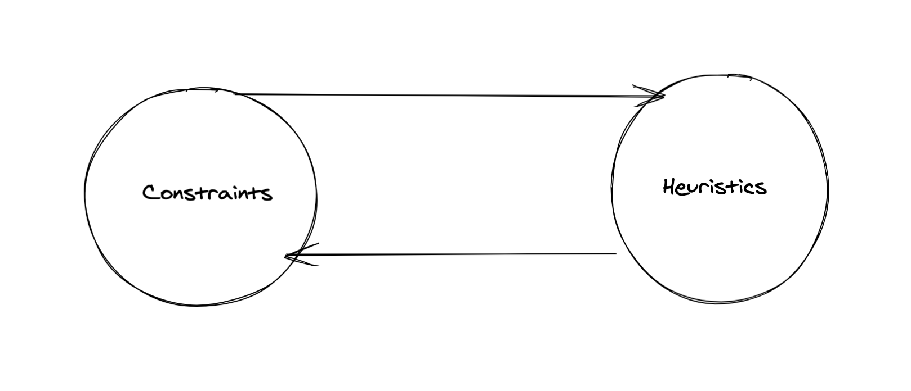

In this post I am going to try and list out what goes into making a good API.

There are no hardbound rules around this area and there is no single algorithm that will solve every use case. But there are some guidelines that I have learned over the years which I would like to share.

Let’s start with defining what an API is in the first place:

It is a means through which a software interacts with other software.

A good metaphor to understand it is a ***car***. How so? Well think of how we “interact” with the car -

1. Start the engine
2. Press the accelerator to move
3. Press break to stop or slow down

Does this change if you change your ***car*** model? No, right? That's because the API is the same! So tomorrow even if I change my ***car*** to an electric one I don’t have to worry about learning how to drive it all over again! This is huge a benefit which we take for granted every day. So in short; it gives you the ability to change everything under the hood without affecting its users.

Now that we have gotten that out of the way lets get to the juicy parts:

There are two core concepts in understanding what makes an API, a good API : **Constraints and Heuristics .** 

Let’s see how and why.

## Constraints

The metaphor we are going to use to understand this is a game called `Tangram`.

It’s a puzzle game where in you have 7 pieces of different shapes. Like this:


Source: Wikipedia


And aim is to create other shapes from these 7 shapes. Like this:


Source: Wikipedia


According to wikipedia there have been 6500 puzzle’s created till date, from just the 7 pieces!

So how does that help us in API design? - Well if you can figure out those “pieces” which give the user to ability to create more “shapes” you have essentially created a composable API.

So lets see what the `constraints` are in the case of `Tangram` :

1. You can only use 7 pieces
2. You only have a few shapes to use.

***Why do constraints matter then?*** 

Well, each API needs to solve a purpose. In the case of a ***car*,** the user needs to be able to drive the car using as minimal interaction as possible.  So by extension, there ought to be some constraints. Or if you are building a payment API, the consumer should be able to make the payment without much fuss. For that, you need to set some constraints and those constraints will define the usage of the API. 

There will be some business constraints that you need to ensure while you design / code for the API. Once it's out there, the control goes to the **consumer** and the API developer doesn't know how it's going to be used and hence certain safety features should also be incorporated. For example, in case of a ***car,*** one would think of all the safety features that are to be incorporated before its manufacturing process because the end user might drive it recklessly or might get involved in some unforeseen situation that leads to accident.

Similarly, in the case of the payment API :

How do you ensure the safety of the payment?

- The user might click on the Pay button many times due to some UI issue.
- Slow internet causing problems.
- Some bad actors might be causing some problems.

These are some of the things you need to consider. All the while making sure that the API is as small and clean as possible. Developer experience should be good. So I hope you are sold on why you need constraints? 

## Now the big question: Given a set of requirements, how do you know what constraints you need to set?

Now, this is a billion-dollar question without a real answer.

This is where software development becomes more creative and a little less science. For some problems, the process can take years to get it right. Heck, there could be many API's to solve the same problem. The ability to set the right constraints at the right point will be something that would differentiate a junior developer from a senior developer  (personal opinion). This intuition comes with experience, practice, and the understanding that there will be trade offs in all the decisions that are made while developing an API.

So is this the end of the blog? Well, no! Like most creative things, there is a feedback loop based on which you could make such decisions. That brings us to the second part of the API design that I alluded to in the beginning - ***Heuristics***.

The feedback loop likes something this: 




Well its nothing fancy now, Is it? But not everything is that simple! Its pretty difficult to execute it in real case scenario.

## Heuristics

Constraints and Heuristics are different sides of the same coin. Let me try and define what I mean by heuristics in general and then try and define it it in the context of API design.

Straight from wikipedia:

> A heuristic technique, or a heuristic, is any approach to problem solving or self-discovery that employs a practical method that is not guaranteed to be optimal, perfect, or rational, but is nevertheless sufficient for reaching an immediate, short-term goal or approximation

From the above definition I hope it's clear why I mentioned this process is more creative than scientific. Heuristics are used by us everyday to make decisions like for example - 

**What should I have for breakfast?** - I mean you could analyze this one endlessly or just look at your fridge and see bread and cheese is available so you just go ahead and eat it.  

Now what do I mean when I say heuristics and constraints are opposite sides of the same coin. 

Lets take the example above i.e. 

**What should i have for breakfast?** - such a simple question but there are many choices:

1. I could go to the mall, get groceries and make something new 

2. go to a restaurant and get something better 

3. I could go for healthy option

      ....  

But I have to get to work, so I am ***constrained*** by time hence the cheese sandwich is the easiest choice I can make. Constraints almost always guide the heuristic. Based on the heuristic you need to adapt the constraint. I hope this makes the above ***loop*** clear.

## Example

Let's take a look at some actual code how this might play out in a real world scenario. I will be using JavaScript for the examples but I will not be using advanced features of the language so hopefully its readable for everyone. 

Here I am building an API for shopping cart specifically the function to get total amount based on the items in cart:

```jsx
/* 
	 Takes one argument called items where each item might look something like this:
    {
			name: 'Soap',
			quantity: 2,
			price : 20
    }

Lets call this V1
   
*/

function getTotal(items) {
		
}
```

Now let's dig into the API - it's one function with one parameter in our case list of items in the cart. In most cases, this should work fine. The consumers would take this function and pass the list of items to it and everyone is happy. Let's update the requirements to accommodate taxes in the calculation.

So how should we deal with this? 

We could update the signature to something like this:

```jsx
function getTotal(items, taxRate){
}
```

This would work. But we have broken the app by adding this!

How? Well, we would have to update all the places where the V1 version was used.

In an ideal world, you would have the requirements beforehand. But these things happen more often than not.

In an ideal world you would have the requirements before hand but these things happen more often than not.  

Perhaps we could do something like this:

```jsx
/* Lets call this V2 */
function getTotal({ items : [] , taxRate: 0 }){
}
```

Now, this seems a little better? The signature for the users hasn't changed only the data structure.

If we were to have published this API from the get-go:

- the changes would be minimal.
- the app would not have broken.
- the consumer wouldn't have to remember the order of the parameters.
- the API is much more malleable to changing requirements.

For example, if we add a new parameter like discount the API won't break:

```jsx
function getTotal({ items : [] , taxRate : 0 , discount: 10}) {
}
```

Now you might be wondering should i change all my functions to accept just single object? 

Well the answer is : 

> It depends!

If it's a small utility function that does one specific thing why bother with an object like input? 

Understanding t**rade offs** is probably the most important part of the API design. 

Let's look at the trade off for the example we just saw:

### In the case of V1:

**Constraint**:

The function could take only one parameter i.e. list of items in a shopping cart.

**Heuristic**:

The consumers used the API across the codebase to calculate the total and passed the items as input. (more constrained the API the more predictable the heuristic)

**Trade-Off:**

- Good developer ergonomics - i.e. consumer has to pass one parameter.
- It's very brittle to changing requirements.

### In the case of V2:

**Constraint:**

The function takes an object as input with parameters being key-value pairs.

**Heuristic:**

The consumers used the API to pass extra parameters without having to break the app.

**Trade-Off:**

- Not so good developer ergonomics.
- Malleable to changing requirements.

I hope reader can see how both cases contrast each other, and this is just with one function 😀.

> Psst, in the above scenario I used a heuristic again to make the API better: ***Data is usually cheaper to change than code.***

## Conclusion

Some general constraints and tips which we can follow while designing an API :

- Keep API surface area small - fewer things can go wrong when fewer things are there for the consumer to do.
- Perfection is the enemy of progress - don't be stuck in the analysis phase for too long. Unintended consequences will be there.
- Spend more time designing/testing/dogfooding lower-level API.
- Before introducing a new API to a wider audience it's generally good sense to use it in a specific case for a while. That will provide valuable feedback to polish the API.
- Composable API's are generally good if you get the constraints right. Since they act like building blocks for the multitude of use cases that can be there.
- Escape hatches are okay - if the API is already in wide use, providing an escape hatch for few use cases is okay. Instead of breaking the API altogether for the sake of clean code.
- Naming things right - this is still hard!
- Test only the public API. Although, be careful metrics like code coverage can become vanity metrics. High code coverage doesn't compensate for bad API design. So when I say test, not different cases but also ergonomics and actual impact.

Thats it for Part 1, I hope you learned something from the post.

In Part 2 - I would try to build on the concepts here with a non-trivial example. 

Thanks for reading!