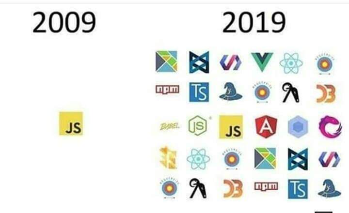

## The Problem

There are many choices that a Developer needs to make when creating any piece of software. Each choice leads to different way of software being built.
The more choices there are the more the trade-offs and each combination of those choices lead to a different result. Sounds like I am just saying something that everybody does where is the problem here?

What is unique in the case of JavaScript is the sheer number of choices to be made is mind-boggling. 

The reasons as for why it is so could be many, but I can think of a few as to why :

 1. JS is highly dynamic by nature and can be adapted to numerous paradigms and patterns.
   
 2. The ecosystem is mostly community driven from build tools to testing frameworks has been developed by the open source community.
   
 3. It has a huge community who come up with very different ways of doing things all the time.
 
The above-mentioned list is not exhaustive but I think gives us an idea as to why it is the way it is.

A sample of choices available:

 - **Build Tool:** Webpack, Parcel, Browserify...  
 - **Testing Framework:** Jest, Mocha, Ava..  
 - **Assertion Framework:** Chai, Jest, Jasmine..  
 - **Frontend Framework:** Vue, React, Angular, Knockout, Backbone, Ember, Vanilla JS..   
 - **Styling Approach:**  CSS-in-JS, CSS Modules, SASS, LESS, Vanilla CSS..  
 - **Utility Libraries:**  Immer, Lodash, ImmutableJS, RamdaJS..  
 - **State Modeling:**  xstate, Microstates, Redux, MobX..  
 - **Async Helpers:**  RxJS, BaconJS..

 ### Picture worth a thousand words

 

This is just one high level of decisions there are multiple sub-decisions that needs to be made. Each combination of choices leads to an extremely different code base even though they use the same underlying language, all these decisions can be modeled as a tree - **the JavaScript decision tree**.

So what? Having these many choices should be a good thing right? Unfortunately when we are trying to build stuff having too many choices can lead to variety of problems: 

 - **Analysis paralysis** - it can lead teams to think too much on the trying to finding the right choice of things to pick, instead of solving the business problem.
 - **Future Anxiety** - The wrong set of choices can lead serious problems if the problem wasn't the right fit for the choices made.
 - **Construct over Artifact** - In the process of making these choices the actual app that we are trying to build might get lost from the picture.
 - **Endless Debates** - Due to number of choices and team of opinionated folks can lead to conflicts and debates, which are highly unproductive.
 - **Inconsistent Codebase** - If the decisions are not made and left to team individuals, based on the choice of library the code can become highly inconsistent and increasing the knowldege curve needed to understand the codebase considerably.

## Possible Solutions

Obviously the solutions I can provide can only help with the problem but cannot elminate it,    since no one can control the community as whole and nor should they. I strongly believe that the reason for such a large adoption of JS is because of its community and open source efforts put in by some really smart folks! So I am not recommending to stop innovating no, I am just trying to ease the pain that can come from having so many choices as a developer who is trying to solve some business problem!.

Solution needs to handle at both People Level and Technical Level:

### Technical Level

From a technical perspective the aim should be to reduce the possible number of decisions that individual dev needs to be make. 

For example, there are certain good practices that have been identified by the community and the industry in general which can be adopted by default using some tools. A good example of such decision is `'use strict'` mode which basically avoids lots of issues by setting some sane constraints and which are enabled by default by tools like `webpack`.

So in that spirit here are some similar steps that will help in dealing with the decision tree by reducing the number of decisions that need to be made by individual developers:

 - Choosing something like `create-react-app` to setup the project which abstracts away setting up webpack and build scripts. This lets us avoid dealing with configuring `webpack` and lot of choices that come with it.
 - Make some highlevel defaults and create single dependency like `react-scripts` with `create-react-app` for your organisation, so that teams starting off new projects don't have to start from step 0.
 - Using tools like `prettier` to keep the formatting consistent instead of configuring `ESLint` for different style rules and relying on developers manually fixing those style guidelines.
 - Create a design system using a predefined set of components (it can be done via vanilla CSS as well).
 - Enforcing certain guideline rules by using `precommit` and `prepush` hooks in `git`.
 - Coming up with a high level architecture based on information flow in the business case.It is highly likely that a set of choices will emerge which can set some good constraints to ensure quality and consistency.
 - Setting up bundlesize limits so that it sets size constrains in the number of libraries that can be included. There are tools like [bundleszie](https://github.com/siddharthkp/bundlesize) which help with setting such constrains.
 - Documenting the recommended patterns and libraries that can be used for the given `app` and updating it as the code base grows. 

### People Level

I think the first and foremost thing to be understood is the fact that no matter what choices are made there is still a fair amount of chance that it will make certain things harder to do! So instead of trying to achieve perfection from the get go the aim should be do to reduce the difficulty in onboarding and try and make the best of choices to best solve the business case that we are trying to solve. And when in where we hit a case which becomes difficult to do we should go ahead and use hacky code to make it work instead of worrying about having made wrong choices (perfection is overrated!). 

So here are some steps that can be helpful: 

 - If you have authority to enforce some choices pick the smallest ones and if possible enforce it a technical level - good example of it is using `prettier` to set the formatting constraints. I think the smaller decisions are where most unproductive debates can happen and many a times making these small decisions can make the bigger decisions obvious or at least easy.
 - At the initial stages of project a discussion on the baseline libraries to be used should be had and number of folks involved should be limited. The reason being more the people involved means more the chances that it can get stuck at analysis stage, if you have ever planned a group trip with friends you can relate to this :-).

 - Encourage incremental adoption, at a highlevel I think it should be something like this:
   - Use of language primitives as much as possible 
   - Create domain specifiic utilities using language primitives which might avoid the need of external libraries.
   - Use of framework primitives - a good example if your team is using `React` and you are passing `props` down to multiple levels instead of using `Redux` one can use the `Context` api to get the job done.
   - Creating domain specific primitives using the framework primitives that will help with dealing with cross cutting concerns (don't do it to early might lead to wrong abstractions!)
 - Documenting the early decisions with explainations can help with making the case for the choice of libraries.
 - Setting up internal sessions on usage and best practices around the libraries that have been chosen and pairing with new joiners can greatly help reduce the friction.
 - Understanding trade offs of different libraries and try to keep the cost to project to a minimum  
 - Last but not least encouraging to be more empathetic and kind to beginners and fellow teammates, since there is no perfect way of doing things :-).

 Again the steps mentioned are not exhaustive and may not necessarily work for everyone but I hope the spirit of my post is clear and hopefully helps others when starting off a JavaScript project!

 Thanks for reading. Happy Coding!

  

 

 