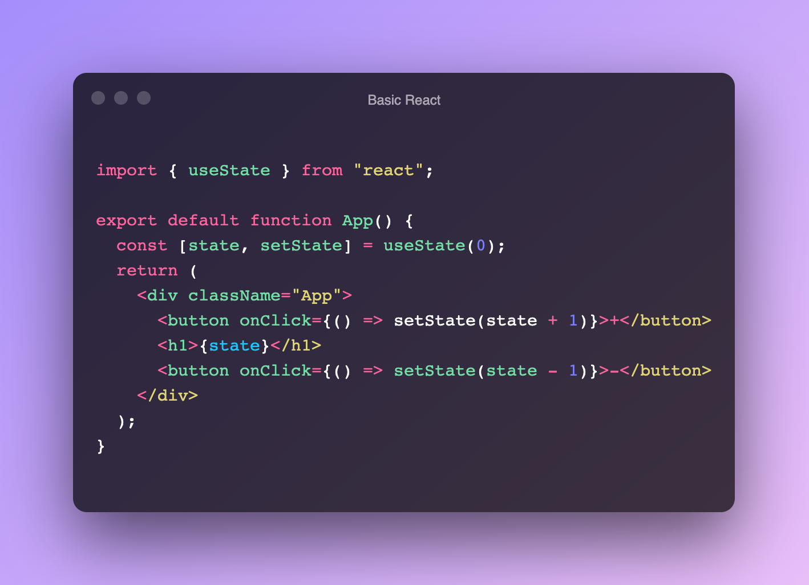
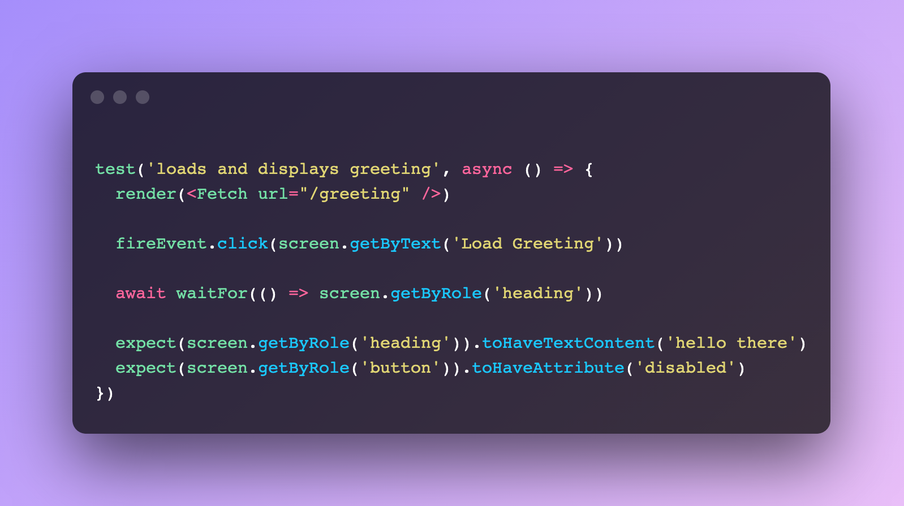
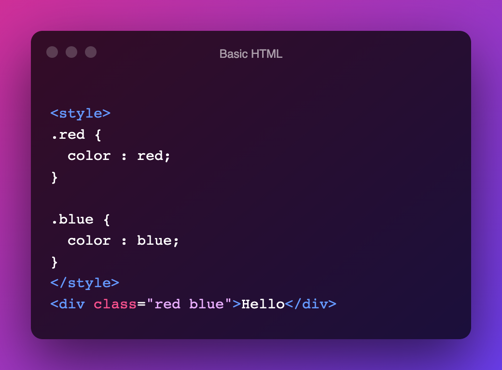

# Why React ?

React has been there long enough that there are people now using it who don't have context over what it brought to the table.

This blog post is for those who have started off UI development with React. Since history is somewhat lost to them I wanted to do a before/after version of UI dev to showcase how React is special.

Just FYI, This post is completely biased 😀.

# Giving Frontend Development some well deserved love.

What do I mean by this? I mean before React came along I felt the state of the industry was stagnant. I mean sure there were plenty of UI libraries like jQuery, Mootools, Bootstrap, etc.

Some approaches to writing CSS like BEM and utility-based frameworks were emerging. Bundling/build tools like browserify, requirejs, gruntjs, gulpjs were coming up in the JS world.

All these made things easier but not ***better.*** We were solving the same problems again and again. We were in a ***rut***.

So how did React bring in the love? By Rethinking the best practices :

[https://www.youtube.com/watch?v=x7cQ3mrcKaY](https://www.youtube.com/watch?v=x7cQ3mrcKaY)

Watch this talk and witness history!

Now I will go through my take on things: 

# Making State Change Explicit

I mean this is so important! Before React came along making state changes was such a pain and required so much planning. Even with the best of constraints, the chances of things going wrong are high without React's API.

Making state changes via declarative API is something we take for granted today. Thanks to React.

A fun exercise for beginners would be to build a small non-trivial app without React. Let the code grow to observe how things can go wrong.

Lets take a look at some code here:

Declarative and beautiful to look at! How did we get by without these?

By glancing at this code itself I know at a high-level what's going on! 

Code is for humans not computers and declarative API is a huge boost to readability.

## Webpack

Okay, now you might be wondering how does this come into my love letter for React? Well, bundlers like Webpack got a huge boost thanks to React.

It solved some nasty problems :

- Imports were clear and the dependency version was easier to manage.
- A single bundled script at the end.
- Bundling different asset types like css/images/js together.
- Ease of cache-busting using hashes.
- ....

tldr = gave us a module system (look up the history if you want to learn more)

My point is it solved a very crucial problem in web dev and React helped make it mainstream.

# Components

Before React there was no concept of components. This basic abstraction now adopted by all the frameworks didn't exist before React.

Think about front-end development without them now

- You can't reuse a piece of UI. You can't import your fancy CTA to any part of a page/app.
- Repetitive HTML structures all over the place.
- CSS can't be co-located.
- Context switching between CSS/HTML/JS is exhausting without this unifying abstraction.
- Do you want to add a click handler? Use addEventListener and attach a function and don't forget to removeEventListener.
- ....

I mean a whole list of conveniences go out the window.

# Escape from MVC

This was huge for me. The model-view-controller pattern was the law of the land. Web Dev/UI Dev begins with the introduction of this pattern.

On the surface, it seems an organized and clean approach to build UI's. But it turns ugly if the constraints are not set right. Again the uncontrolled state changes reared its head. 

Complexity everywhere.

# Making FP mainstream

I have read books like **Structure and Interpretation of Computer Programs (SICP).**   In it, the author proposes that computer science is about controlling complexity. I couldn't agree more.

This reinforces my earlier point - Code is for humans, not computers. Any constraint that helps do this is great. React provides those right constraints :

- State changes happen in one direction
- At a given time you are only looking at one component.
- State change can happen only through the React API.

How is this all related to FP (Functional Programming)? Well, this what FP advocates for - minimising state changes and providing an API to do it when you must.  Limiting the number of things a developer needs to keep in mind - a single component.

FP has a rep for being hard to learn and use. React made those hard to use idea's into simple abstractions - thereby making FP mainstream.

> The constraints imposed in building large software systems are the limitations of our own mind.
-Harold Abelson

# Letting JS be JS(X)

By introducing one step to the build process. We open up a world of possibilities. The best part you don't have to learn another language altogether.

You can grow your skills with JS itself and as language grows so does your ability to extend JSX which is such a powerful thing we take for granted now.

I can use template strings, observables, iterables, promises, generators. All these new JS features now at our disposal without resorting to convoluted hacks.

No more learning additional templating language. 

# Composition

Well I wrote whole another blog post on it:

[https://varenya.dev/composition-react/](https://varenya.dev/composition-react/)

# Unit Testing

Now this is feasible thanks to components. The feedback loop from this is so good and I can't recommend this library enough : [https://testing-library.com/docs/react-testing-library/intro/](https://testing-library.com/docs/react-testing-library/intro/)

You can TDD your UI now - this is powerful.

Example code straight from the docs:

Again a declarative API.

# CSS-In-JS

Well this is controversial but again I am fan of this approach. Things are changing in this landscape but this again broke a lot of conventions which I think React triggered. Basically it eliminated the complexity of CSS selectors. 

It looks something like this:

.png)

Straight out of a example in css-in-js library called [emotion](https://emotion.sh/docs/introduction). Here, what you see is what you get.

Contrast this with good old html/css: 

Now can you tell me what colour the text "hello" will be?  Basically you need to understand the specificity rules around CSS and determine what it is you get finally. 

# Making state management a thing

Well as soon as React introduced these new abstractions folks started thinking of state management as a thing and it kicked off a whole new set of libraries and ecosystems. 

React initially recommended the flux pattern and few libraries emerged around the recommended pattern the most popular among them being **Redux.**

But now we have a whole sets of libraries with unique approaches:

- [https://xstate.js.org/](https://xstate.js.org/) (Finite State Machines 🤯)
- [https://mobx-state-tree.js.org/intro/welcome](https://mobx-state-tree.js.org/intro/welcome) (FRP)
- [https://github.com/pmndrs/valtio](https://github.com/pmndrs/valtio)
- [https://github.com/pmndrs/jotai](https://github.com/pmndrs/jotai)
- [https://mobx.js.org/README.html](https://mobx.js.org/README.html)
- [https://recoiljs.org/](https://recoiljs.org/)
- ...

And probably so many more I am not aware of. They are not directly related to React but I think it triggered it.